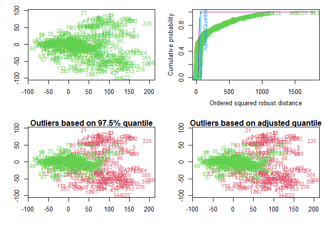
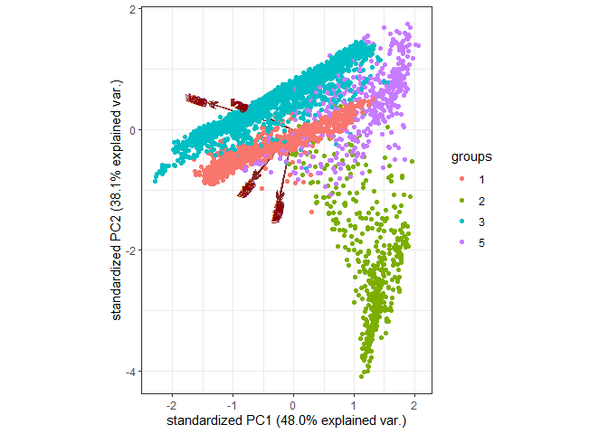

Landsat
================
Masuzyo Mwanza, Rachel Wang
4/2/2020

# EDA

``` r
set.seed(260)
train <- read.table("sat.trn",sep = " ")
```

``` r
test <- read.table("sat.tst",sep=" ")
```

``` r
ggpairs(train[,1:9])
```

<!-- -->

``` r
ggpairs(train[,10:18])
```

<!-- -->

``` r
ggpairs(train[,19:27])
```

<!-- -->

``` r
ggpairs(train[,27:36])
```

<!-- -->

``` r
pic.tr <-as.data.frame(train[,1:36])
pic.ts <- as.data.frame(test[,1:36])
res <- as.factor(train[,37])
res1 <- as.factor(test[,37])
```

test normality with groups

``` r
train1 <- cbind(pic.tr,res)
mvn(train1,subset="res",multivariatePlot = "qq")
```

<!-- --><!-- --><!-- --><!-- --><!-- --><!-- -->

    ## $multivariateNormality
    ## $multivariateNormality$`1`
    ##            Test       HZ p value MVN
    ## 1 Henze-Zirkler 1.000152       0  NO
    ## 
    ## $multivariateNormality$`2`
    ##            Test       HZ p value MVN
    ## 1 Henze-Zirkler 1.001308       0  NO
    ## 
    ## $multivariateNormality$`3`
    ##            Test       HZ p value MVN
    ## 1 Henze-Zirkler 1.000283       0  NO
    ## 
    ## $multivariateNormality$`4`
    ##            Test       HZ p value MVN
    ## 1 Henze-Zirkler 1.000165       0  NO
    ## 
    ## $multivariateNormality$`5`
    ##            Test       HZ p value MVN
    ## 1 Henze-Zirkler 1.000319       0  NO
    ## 
    ## $multivariateNormality$`7`
    ##            Test       HZ p value MVN
    ## 1 Henze-Zirkler 1.000471       0  NO
    ## 
    ## 
    ## $univariateNormality
    ## $univariateNormality$`1`
    ##                Test  Variable Statistic   p value Normality
    ## 1  Anderson-Darling    V1        9.1510  <0.001      NO    
    ## 2  Anderson-Darling    V2       23.3253  <0.001      NO    
    ## 3  Anderson-Darling    V3       16.3932  <0.001      NO    
    ## 4  Anderson-Darling    V4       15.9797  <0.001      NO    
    ## 5  Anderson-Darling    V5        8.2781  <0.001      NO    
    ## 6  Anderson-Darling    V6       20.8923  <0.001      NO    
    ## 7  Anderson-Darling    V7       16.9425  <0.001      NO    
    ## 8  Anderson-Darling    V8       14.4289  <0.001      NO    
    ## 9  Anderson-Darling    V9        9.5206  <0.001      NO    
    ## 10 Anderson-Darling    V10      19.6959  <0.001      NO    
    ## 11 Anderson-Darling    V11      13.7304  <0.001      NO    
    ## 12 Anderson-Darling    V12      11.4921  <0.001      NO    
    ## 13 Anderson-Darling    V13       8.2788  <0.001      NO    
    ## 14 Anderson-Darling    V14      25.4711  <0.001      NO    
    ## 15 Anderson-Darling    V15      16.1623  <0.001      NO    
    ## 16 Anderson-Darling    V16      17.3206  <0.001      NO    
    ## 17 Anderson-Darling    V17       8.6060  <0.001      NO    
    ## 18 Anderson-Darling    V18      25.8691  <0.001      NO    
    ## 19 Anderson-Darling    V19      16.7472  <0.001      NO    
    ## 20 Anderson-Darling    V20      17.2554  <0.001      NO    
    ## 21 Anderson-Darling    V21      11.2652  <0.001      NO    
    ## 22 Anderson-Darling    V22      25.7265  <0.001      NO    
    ## 23 Anderson-Darling    V23      16.6883  <0.001      NO    
    ## 24 Anderson-Darling    V24      17.1521  <0.001      NO    
    ## 25 Anderson-Darling    V25       8.4928  <0.001      NO    
    ## 26 Anderson-Darling    V26      21.3317  <0.001      NO    
    ## 27 Anderson-Darling    V27      15.2326  <0.001      NO    
    ## 28 Anderson-Darling    V28      15.9456  <0.001      NO    
    ## 29 Anderson-Darling    V29      11.1978  <0.001      NO    
    ## 30 Anderson-Darling    V30      24.2340  <0.001      NO    
    ## 31 Anderson-Darling    V31      17.7720  <0.001      NO    
    ## 32 Anderson-Darling    V32      17.2572  <0.001      NO    
    ## 33 Anderson-Darling    V33      12.5195  <0.001      NO    
    ## 34 Anderson-Darling    V34      23.1836  <0.001      NO    
    ## 35 Anderson-Darling    V35      16.3653  <0.001      NO    
    ## 36 Anderson-Darling    V36      16.4489  <0.001      NO    
    ## 
    ## $univariateNormality$`2`
    ##                Test  Variable Statistic   p value Normality
    ## 1  Anderson-Darling    V1       41.9954  <0.001      NO    
    ## 2  Anderson-Darling    V2       49.0244  <0.001      NO    
    ## 3  Anderson-Darling    V3        1.3331  0.0018      NO    
    ## 4  Anderson-Darling    V4       10.5665  <0.001      NO    
    ## 5  Anderson-Darling    V5       40.3056  <0.001      NO    
    ## 6  Anderson-Darling    V6       54.8950  <0.001      NO    
    ## 7  Anderson-Darling    V7        1.3806  0.0014      NO    
    ## 8  Anderson-Darling    V8       10.6086  <0.001      NO    
    ## 9  Anderson-Darling    V9       43.2152  <0.001      NO    
    ## 10 Anderson-Darling    V10      58.9587  <0.001      NO    
    ## 11 Anderson-Darling    V11       1.6002   4e-04      NO    
    ## 12 Anderson-Darling    V12       9.2935  <0.001      NO    
    ## 13 Anderson-Darling    V13      47.2618  <0.001      NO    
    ## 14 Anderson-Darling    V14      56.6827  <0.001      NO    
    ## 15 Anderson-Darling    V15       1.2429  0.0031      NO    
    ## 16 Anderson-Darling    V16      10.7897  <0.001      NO    
    ## 17 Anderson-Darling    V17      37.0630  <0.001      NO    
    ## 18 Anderson-Darling    V18      47.5487  <0.001      NO    
    ## 19 Anderson-Darling    V19       1.7260   2e-04      NO    
    ## 20 Anderson-Darling    V20       7.8922  <0.001      NO    
    ## 21 Anderson-Darling    V21      39.4805  <0.001      NO    
    ## 22 Anderson-Darling    V22      53.1749  <0.001      NO    
    ## 23 Anderson-Darling    V23       1.6383   3e-04      NO    
    ## 24 Anderson-Darling    V24      10.2774  <0.001      NO    
    ## 25 Anderson-Darling    V25      48.5603  <0.001      NO    
    ## 26 Anderson-Darling    V26      58.2035  <0.001      NO    
    ## 27 Anderson-Darling    V27       1.8440   1e-04      NO    
    ## 28 Anderson-Darling    V28      13.8449  <0.001      NO    
    ## 29 Anderson-Darling    V29      44.4032  <0.001      NO    
    ## 30 Anderson-Darling    V30      54.6628  <0.001      NO    
    ## 31 Anderson-Darling    V31       2.1188  <0.001      NO    
    ## 32 Anderson-Darling    V32      13.8537  <0.001      NO    
    ## 33 Anderson-Darling    V33      43.3570  <0.001      NO    
    ## 34 Anderson-Darling    V34      53.8635  <0.001      NO    
    ## 35 Anderson-Darling    V35       2.8393  <0.001      NO    
    ## 36 Anderson-Darling    V36      13.6360  <0.001      NO    
    ## 
    ## $univariateNormality$`3`
    ##                Test  Variable Statistic   p value Normality
    ## 1  Anderson-Darling    V1       11.5344  <0.001      NO    
    ## 2  Anderson-Darling    V2       10.9452  <0.001      NO    
    ## 3  Anderson-Darling    V3        5.4135  <0.001      NO    
    ## 4  Anderson-Darling    V4        5.6222  <0.001      NO    
    ## 5  Anderson-Darling    V5       10.9190  <0.001      NO    
    ## 6  Anderson-Darling    V6       11.4176  <0.001      NO    
    ## 7  Anderson-Darling    V7        5.5328  <0.001      NO    
    ## 8  Anderson-Darling    V8        6.4266  <0.001      NO    
    ## 9  Anderson-Darling    V9       18.8560  <0.001      NO    
    ## 10 Anderson-Darling    V10      24.6212  <0.001      NO    
    ## 11 Anderson-Darling    V11      11.1899  <0.001      NO    
    ## 12 Anderson-Darling    V12      17.5443  <0.001      NO    
    ## 13 Anderson-Darling    V13       8.4594  <0.001      NO    
    ## 14 Anderson-Darling    V14       5.9652  <0.001      NO    
    ## 15 Anderson-Darling    V15       4.3081  <0.001      NO    
    ## 16 Anderson-Darling    V16       4.8723  <0.001      NO    
    ## 17 Anderson-Darling    V17       6.9323  <0.001      NO    
    ## 18 Anderson-Darling    V18       4.7964  <0.001      NO    
    ## 19 Anderson-Darling    V19       4.2119  <0.001      NO    
    ## 20 Anderson-Darling    V20       4.5649  <0.001      NO    
    ## 21 Anderson-Darling    V21      10.8833  <0.001      NO    
    ## 22 Anderson-Darling    V22       8.9399  <0.001      NO    
    ## 23 Anderson-Darling    V23       6.7442  <0.001      NO    
    ## 24 Anderson-Darling    V24      11.1142  <0.001      NO    
    ## 25 Anderson-Darling    V25      20.5349  <0.001      NO    
    ## 26 Anderson-Darling    V26      23.5700  <0.001      NO    
    ## 27 Anderson-Darling    V27       5.4457  <0.001      NO    
    ## 28 Anderson-Darling    V28       5.9169  <0.001      NO    
    ## 29 Anderson-Darling    V29       9.5796  <0.001      NO    
    ## 30 Anderson-Darling    V30       6.8901  <0.001      NO    
    ## 31 Anderson-Darling    V31       4.7950  <0.001      NO    
    ## 32 Anderson-Darling    V32       5.0759  <0.001      NO    
    ## 33 Anderson-Darling    V33      16.2804  <0.001      NO    
    ## 34 Anderson-Darling    V34      11.0495  <0.001      NO    
    ## 35 Anderson-Darling    V35      12.9396  <0.001      NO    
    ## 36 Anderson-Darling    V36      13.0073  <0.001      NO    
    ## 
    ## $univariateNormality$`4`
    ##                Test  Variable Statistic   p value Normality
    ## 1  Anderson-Darling    V1        2.8292  <0.001      NO    
    ## 2  Anderson-Darling    V2        7.4718  <0.001      NO    
    ## 3  Anderson-Darling    V3        3.3035  <0.001      NO    
    ## 4  Anderson-Darling    V4        5.2733  <0.001      NO    
    ## 5  Anderson-Darling    V5        2.6244  <0.001      NO    
    ## 6  Anderson-Darling    V6        5.2809  <0.001      NO    
    ## 7  Anderson-Darling    V7        1.9729  <0.001      NO    
    ## 8  Anderson-Darling    V8        2.1594  <0.001      NO    
    ## 9  Anderson-Darling    V9        2.2648  <0.001      NO    
    ## 10 Anderson-Darling    V10       5.9344  <0.001      NO    
    ## 11 Anderson-Darling    V11       1.1624  0.0048      NO    
    ## 12 Anderson-Darling    V12       4.6095  <0.001      NO    
    ## 13 Anderson-Darling    V13       1.5686   5e-04      NO    
    ## 14 Anderson-Darling    V14       3.0948  <0.001      NO    
    ## 15 Anderson-Darling    V15       1.5678   5e-04      NO    
    ## 16 Anderson-Darling    V16       1.5824   4e-04      NO    
    ## 17 Anderson-Darling    V17       2.3086  <0.001      NO    
    ## 18 Anderson-Darling    V18       3.2079  <0.001      NO    
    ## 19 Anderson-Darling    V19       2.0581  <0.001      NO    
    ## 20 Anderson-Darling    V20       1.7096   2e-04      NO    
    ## 21 Anderson-Darling    V21       1.9655   1e-04      NO    
    ## 22 Anderson-Darling    V22       2.2195  <0.001      NO    
    ## 23 Anderson-Darling    V23       1.5320   6e-04      NO    
    ## 24 Anderson-Darling    V24       1.2337  0.0032      NO    
    ## 25 Anderson-Darling    V25       1.8185   1e-04      NO    
    ## 26 Anderson-Darling    V26       1.8754   1e-04      NO    
    ## 27 Anderson-Darling    V27       1.3178   0.002      NO    
    ## 28 Anderson-Darling    V28       0.9503  0.0162      NO    
    ## 29 Anderson-Darling    V29       2.3142  <0.001      NO    
    ## 30 Anderson-Darling    V30       3.5865  <0.001      NO    
    ## 31 Anderson-Darling    V31       1.3005  0.0022      NO    
    ## 32 Anderson-Darling    V32       2.1139  <0.001      NO    
    ## 33 Anderson-Darling    V33       3.2851  <0.001      NO    
    ## 34 Anderson-Darling    V34       5.4875  <0.001      NO    
    ## 35 Anderson-Darling    V35       1.7683   2e-04      NO    
    ## 36 Anderson-Darling    V36       4.4611  <0.001      NO    
    ## 
    ## $univariateNormality$`5`
    ##                Test  Variable Statistic   p value Normality
    ## 1  Anderson-Darling    V1       10.1755  <0.001      NO    
    ## 2  Anderson-Darling    V2       15.9689  <0.001      NO    
    ## 3  Anderson-Darling    V3        5.7970  <0.001      NO    
    ## 4  Anderson-Darling    V4        1.1899  0.0042      NO    
    ## 5  Anderson-Darling    V5        8.6827  <0.001      NO    
    ## 6  Anderson-Darling    V6       15.7943  <0.001      NO    
    ## 7  Anderson-Darling    V7        5.8477  <0.001      NO    
    ## 8  Anderson-Darling    V8        2.0092  <0.001      NO    
    ## 9  Anderson-Darling    V9        8.5640  <0.001      NO    
    ## 10 Anderson-Darling    V10      14.1656  <0.001      NO    
    ## 11 Anderson-Darling    V11       6.2917  <0.001      NO    
    ## 12 Anderson-Darling    V12       3.0682  <0.001      NO    
    ## 13 Anderson-Darling    V13       8.8721  <0.001      NO    
    ## 14 Anderson-Darling    V14      14.1077  <0.001      NO    
    ## 15 Anderson-Darling    V15       3.9962  <0.001      NO    
    ## 16 Anderson-Darling    V16       0.7248  0.0584      YES   
    ## 17 Anderson-Darling    V17       7.3711  <0.001      NO    
    ## 18 Anderson-Darling    V18      14.0974  <0.001      NO    
    ## 19 Anderson-Darling    V19       4.7500  <0.001      NO    
    ## 20 Anderson-Darling    V20       0.9114  0.0202      NO    
    ## 21 Anderson-Darling    V21       9.4705  <0.001      NO    
    ## 22 Anderson-Darling    V22      17.9296  <0.001      NO    
    ## 23 Anderson-Darling    V23       5.1232  <0.001      NO    
    ## 24 Anderson-Darling    V24       1.2184  0.0035      NO    
    ## 25 Anderson-Darling    V25       8.0434  <0.001      NO    
    ## 26 Anderson-Darling    V26      11.7199  <0.001      NO    
    ## 27 Anderson-Darling    V27       2.7508  <0.001      NO    
    ## 28 Anderson-Darling    V28       0.7403  0.0534      YES   
    ## 29 Anderson-Darling    V29      10.8212  <0.001      NO    
    ## 30 Anderson-Darling    V30      15.5793  <0.001      NO    
    ## 31 Anderson-Darling    V31       3.3471  <0.001      NO    
    ## 32 Anderson-Darling    V32       0.5861  0.1262      YES   
    ## 33 Anderson-Darling    V33      12.8167  <0.001      NO    
    ## 34 Anderson-Darling    V34      17.0652  <0.001      NO    
    ## 35 Anderson-Darling    V35       4.4881  <0.001      NO    
    ## 36 Anderson-Darling    V36       0.9035  0.0211      NO    
    ## 
    ## $univariateNormality$`7`
    ##                Test  Variable Statistic   p value Normality
    ## 1  Anderson-Darling    V1       24.0062  <0.001      NO    
    ## 2  Anderson-Darling    V2       16.9111  <0.001      NO    
    ## 3  Anderson-Darling    V3       15.6823  <0.001      NO    
    ## 4  Anderson-Darling    V4       23.9759  <0.001      NO    
    ## 5  Anderson-Darling    V5       21.2057  <0.001      NO    
    ## 6  Anderson-Darling    V6       14.4107  <0.001      NO    
    ## 7  Anderson-Darling    V7       15.6914  <0.001      NO    
    ## 8  Anderson-Darling    V8       19.8403  <0.001      NO    
    ## 9  Anderson-Darling    V9       22.1425  <0.001      NO    
    ## 10 Anderson-Darling    V10      16.2338  <0.001      NO    
    ## 11 Anderson-Darling    V11      18.3983  <0.001      NO    
    ## 12 Anderson-Darling    V12      20.3835  <0.001      NO    
    ## 13 Anderson-Darling    V13      23.1489  <0.001      NO    
    ## 14 Anderson-Darling    V14      12.7699  <0.001      NO    
    ## 15 Anderson-Darling    V15      11.5096  <0.001      NO    
    ## 16 Anderson-Darling    V16      14.5916  <0.001      NO    
    ## 17 Anderson-Darling    V17      19.4866  <0.001      NO    
    ## 18 Anderson-Darling    V18       9.9695  <0.001      NO    
    ## 19 Anderson-Darling    V19      10.9794  <0.001      NO    
    ## 20 Anderson-Darling    V20      13.6561  <0.001      NO    
    ## 21 Anderson-Darling    V21      25.7593  <0.001      NO    
    ## 22 Anderson-Darling    V22      16.2190  <0.001      NO    
    ## 23 Anderson-Darling    V23      15.3342  <0.001      NO    
    ## 24 Anderson-Darling    V24      19.2021  <0.001      NO    
    ## 25 Anderson-Darling    V25      19.3354  <0.001      NO    
    ## 26 Anderson-Darling    V26      12.4192  <0.001      NO    
    ## 27 Anderson-Darling    V27      13.4165  <0.001      NO    
    ## 28 Anderson-Darling    V28      15.1004  <0.001      NO    
    ## 29 Anderson-Darling    V29      23.3608  <0.001      NO    
    ## 30 Anderson-Darling    V30      13.6946  <0.001      NO    
    ## 31 Anderson-Darling    V31      16.7310  <0.001      NO    
    ## 32 Anderson-Darling    V32      21.1627  <0.001      NO    
    ## 33 Anderson-Darling    V33      28.1808  <0.001      NO    
    ## 34 Anderson-Darling    V34      16.7636  <0.001      NO    
    ## 35 Anderson-Darling    V35      19.6556  <0.001      NO    
    ## 36 Anderson-Darling    V36      22.7379  <0.001      NO    
    ## 
    ## 
    ## $Descriptives
    ## $Descriptives$`1`
    ##        n      Mean   Std.Dev Median Min Max  25th   75th        Skew
    ## V1  1072  63.32090  8.489330   64.0  46  97 57.00  68.00  0.48525009
    ## V2  1072  95.53172 14.551975   99.0  61 121 83.00 108.00 -0.39765475
    ## V3  1072 108.14086 12.638836  111.0  76 135 98.00 119.00 -0.42350682
    ## V4  1072  88.50466  8.984060   90.0  65 107 81.00  96.00 -0.36398131
    ## V5  1072  63.02519  8.093312   63.0  46  97 57.00  68.00  0.34087293
    ## V6  1072  95.19590 14.619253   98.0  43 121 83.00 108.00 -0.42973687
    ## V7  1072 107.88526 12.516166  110.0  76 131 98.00 119.00 -0.42320307
    ## V8  1072  88.47854  8.983412   90.0  65 122 81.00  96.00 -0.22098313
    ## V9  1072  62.72575  7.868514   63.0  46  97 57.00  67.00  0.24677554
    ## V10 1072  94.58302 15.101110   97.5  31 121 83.00 107.00 -0.54136881
    ## V11 1072 107.46549 12.551099  110.0  74 135 97.00 118.00 -0.36555690
    ## V12 1072  88.25280  9.324951   89.0  65 128 80.75  96.00  0.03489924
    ## V13 1072  62.98134  8.340200   63.0  46  97 56.00  68.00  0.39324904
    ## V14 1072  95.30224 14.548739   99.0  61 121 83.00 108.00 -0.37419353
    ## V15 1072 108.07090 12.723616  111.0  76 135 98.00 119.00 -0.39975063
    ## V16 1072  88.52425  8.937242   90.0  65 104 81.00  96.00 -0.34168140
    ## V17 1072  62.82556  8.021469   63.0  46  97 57.00  68.00  0.24467973
    ## V18 1072  95.29384 14.548237   99.0  61 121 83.00 108.00 -0.39778471
    ## V19 1072 108.12313 12.636916  111.0  74 135 98.00 118.25 -0.41879544
    ## V20 1072  88.60075  8.824099   90.0  65 104 81.00  96.00 -0.33931793
    ## V21 1072  62.62593  7.574528   63.0  46  92 56.75  67.00  0.03325635
    ## V22 1072  94.87500 14.666515   99.0  54 121 83.00 107.00 -0.42372946
    ## V23 1072 107.75187 12.642465  110.0  74 135 97.00 118.00 -0.40167928
    ## V24 1072  88.34422  8.903046   90.0  65 113 81.00  96.00 -0.30009715
    ## V25 1072  62.56250  8.067399   63.0  43  97 56.00  68.00  0.23210484
    ## V26 1072  94.52052 14.726246   97.0  34 121 83.00 107.00 -0.42511933
    ## V27 1072 107.55877 12.545875  110.0  74 133 97.00 118.00 -0.34739323
    ## V28 1072  88.22668  8.956890   90.0  65 125 81.00  96.00 -0.17312679
    ## V29 1072  62.52332  7.822817   63.0  46  92 56.00  68.00  0.03395533
    ## V30 1072  94.73414 14.751259   99.0  48 121 83.00 107.00 -0.39430944
    ## V31 1072 107.65765 12.656983  110.0  74 133 97.00 118.00 -0.40115462
    ## V32 1072  88.33862  8.914370   90.0  65 107 81.00  96.00 -0.31372723
    ## V33 1072  62.39366  7.558417   63.0  46  92 56.00  67.00 -0.03205030
    ## V34 1072  94.65858 14.645613   98.0  40 120 83.00 107.00 -0.39298731
    ## V35 1072 107.70149 12.547519  110.0  76 131 97.00 118.00 -0.37357547
    ## V36 1072  88.38806  8.919422   90.0  65 122 81.00  96.00 -0.28052611
    ##         Kurtosis
    ## V1   0.817649267
    ## V2  -1.081268565
    ## V3  -0.839902990
    ## V4  -0.928167740
    ## V5   0.685828376
    ## V6  -0.899000058
    ## V7  -0.867589161
    ## V8  -0.814411329
    ## V9   0.561564608
    ## V10 -0.350946752
    ## V11 -0.852908579
    ## V12 -0.005195643
    ## V13  0.542315472
    ## V14 -1.138765703
    ## V15 -0.876265743
    ## V16 -0.990397935
    ## V17  0.432887979
    ## V18 -1.117398403
    ## V19 -0.848664081
    ## V20 -0.997823998
    ## V21 -0.100873562
    ## V22 -1.059434708
    ## V23 -0.880462839
    ## V24 -1.002191581
    ## V25  0.208752924
    ## V26 -0.726812864
    ## V27 -0.935219468
    ## V28 -0.649510218
    ## V29 -0.292434108
    ## V30 -1.062720205
    ## V31 -0.932392316
    ## V32 -1.028249026
    ## V33 -0.305545672
    ## V34 -1.002316640
    ## V35 -0.929426586
    ## V36 -0.867356471
    ## 
    ## $Descriptives$`2`
    ##       n      Mean   Std.Dev Median Min Max  25th 75th       Skew    Kurtosis
    ## V1  479  50.40919  9.770569     46  40  89  44.0   52  1.7397402  2.29700132
    ## V2  479  43.03758 17.760336     34  27 106  32.0   48  1.6199641  1.55146258
    ## V3  479 112.51148 14.187160    113  70 140 104.0  123 -0.3595120 -0.13962926
    ## V4  479 115.33403 22.341705    121  57 154 101.5  133 -0.6950349 -0.47200933
    ## V5  479  49.71608  8.794657     46  40  88  44.0   50  2.0142603  3.90848167
    ## V6  479  41.88309 16.938200     34  27 107  32.0   43  1.9411070  2.90861242
    ## V7  479 112.87683 13.762612    113  70 145 104.0  123 -0.3980776  0.08438423
    ## V8  479 116.12526 21.582598    121  57 157 103.0  133 -0.7502322 -0.28434495
    ## V9  479  49.75574  9.307218     46  40  90  44.0   51  2.1934979  4.90756505
    ## V10 479  42.28392 18.158725     34  27 111  32.0   43  2.0280578  3.24248263
    ## V11 479 113.15866 13.988186    114  68 145 104.0  123 -0.4684374  0.30953570
    ## V12 479 116.06681 21.870476    121  53 157 103.0  133 -0.7471206 -0.18814520
    ## V13 479  50.01670  9.635823     46  40  92  44.0   50  2.0451878  3.79797046
    ## V14 479  41.63257 16.912112     34  27 106  32.0   43  1.9273871  2.79120680
    ## V15 479 113.58455 12.701788    114  70 145 104.0  123 -0.1826124 -0.38292522
    ## V16 479 117.62422 19.942614    122  64 151 106.0  133 -0.7476549 -0.31216645
    ## V17 479  48.83925  7.570674     46  40  78  44.0   50  1.8480092  3.01645645
    ## V18 479  39.91441 13.483252     34  27  88  32.0   42  1.8302090  2.54568018
    ## V19 479 113.88935 12.641098    114  82 139 104.0  124 -0.1015533 -0.66943294
    ## V20 479 118.31106 19.293952    122  67 157 105.0  133 -0.6594408 -0.34760527
    ## V21 479  48.92693  8.034763     46  39  88  44.0   50  2.2217816  5.45122890
    ## V22 479  40.32359 15.040451     34  27 103  32.0   40  2.1469010  4.18737802
    ## V23 479 113.49478 13.554457    114  74 140 104.0  124 -0.3521058 -0.18232291
    ## V24 479 117.43424 21.078141    122  55 154 107.0  133 -0.8646036  0.09535550
    ## V25 479  50.86848 10.802982     46  40  97  44.0   52  1.7759523  2.41893925
    ## V26 479  43.51566 19.641432     34  27 115  32.0   45  1.6843345  1.69281600
    ## V27 479 113.09395 13.640542    114  75 140 104.0  123 -0.3229284 -0.44388530
    ## V28 479 116.24843 22.173688    122  54 154 104.0  133 -0.8270373 -0.24149512
    ## V29 479  49.87683  9.203389     46  39  89  44.0   51  1.7549707  2.40408018
    ## V30 479  41.47390 16.453524     34  27 102  31.0   43  1.7391533  1.98168555
    ## V31 479 113.17954 13.997053    114  67 145 104.0  123 -0.4513248 -0.08454748
    ## V32 479 116.93528 22.029221    124  51 157 105.0  133 -0.9445101  0.14117639
    ## V33 479  49.48434  8.514771     46  40  82  44.0   50  1.6922842  2.07800417
    ## V34 479  41.06889 15.519641     34  27 100  31.0   43  1.7083674  1.91044154
    ## V35 479 112.54489 14.594576    114  70 145 104.0  123 -0.5273291 -0.01521953
    ## V36 479 115.97912 23.171987    122  53 157 104.0  133 -0.9425755  0.13714867
    ## 
    ## $Descriptives$`3`
    ##       n      Mean   Std.Dev Median Min Max 25th 75th         Skew   Kurtosis
    ## V1  961  86.93861  6.360472     88  56 104   84   92 -0.948925483  2.8958821
    ## V2  961 104.34131  9.204734    104  56 137   99  111 -0.981234757  3.7689905
    ## V3  961 109.72008  8.461906    110  71 139  105  114 -0.192657721  2.0205138
    ## V4  961  86.83247  6.617529     87  58 109   83   91 -0.191780418  1.7330057
    ## V5  961  86.96982  6.153939     88  56 102   84   92 -0.824970208  2.2901635
    ## V6  961 104.56504  8.958596    106  58 137  100  111 -0.966557999  3.4325408
    ## V7  961 109.82934  8.334792    110  75 139  105  114 -0.299921346  1.7921909
    ## V8  961  86.89074  6.632584     87  58 109   83   91 -0.412156272  1.9900402
    ## V9  961  86.43496  6.813298     88  48 104   84   90 -1.382447485  4.4204088
    ## V10 961 103.83871 10.166325    106  34 130   99  111 -1.986339505  8.2913111
    ## V11 961 109.40895  8.903901    110  64 136  105  114 -1.086294638  4.3611116
    ## V12 961  86.60250  7.749204     87  34 137   83   91 -1.315835094  9.6909483
    ## V13 961  87.42144  5.739149     88  53 102   84   92 -0.708008382  2.2773351
    ## V14 961 105.17794  8.215114    106  56 131  100  111 -0.570176099  2.9811092
    ## V15 961 110.61186  7.588384    111  79 139  105  114  0.328535596  0.9204931
    ## V16 961  87.52653  6.031996     87  63 109   83   92  0.311219948  0.5892150
    ## V17 961  87.47867  5.039615     88  70 104   84   92 -0.075037072  0.1003833
    ## V18 961 105.49844  6.865694    106  83 130  100  111  0.210614320  0.2157025
    ## V19 961 110.59625  7.231395    110  85 139  105  114  0.288888041  0.7861493
    ## V20 961  87.45682  6.047077     87  59 109   83   92  0.007165039  1.0997751
    ## V21 961  86.86368  5.984280     88  56 104   84   92 -0.893005057  2.6667799
    ## V22 961 104.73361  8.264747    106  57 130   99  111 -1.135262379  4.9176091
    ## V23 961 109.83039  8.340748    110  63 136  105  114 -0.884058829  4.3946935
    ## V24 961  87.00000  7.344074     87  34 109   83   92 -1.654810221  9.6386880
    ## V25 961  86.87097  7.081814     88  44 104   84   92 -1.779789061  7.1238392
    ## V26 961 104.55879 10.478794    106  34 131   99  111 -2.134622170 10.2736620
    ## V27 961 110.45473  8.319923    110  74 139  105  115 -0.169990392  1.7783299
    ## V28 961  87.65765  7.172892     87  54 125   83   92  0.053618970  2.5774239
    ## V29 961  86.86681  6.117508     88  49 104   84   92 -0.874977667  2.5301380
    ## V30 961 104.91051  8.471540    106  40 128  100  111 -0.929663776  4.6649998
    ## V31 961 109.99792  8.170959    110  76 139  105  114 -0.240588713  1.3938033
    ## V32 961  87.19563  6.960994     87  54 114   83   92 -0.361153807  1.6660318
    ## V33 961  86.21644  6.726888     88  55 104   83   90 -1.160737281  2.7332423
    ## V34 961 104.08429  8.873425    104  57 130   99  111 -1.096198771  3.6966444
    ## V35 961 109.23413  9.029484    110  63 136  104  114 -1.079537703  3.9889995
    ## V36 961  86.52445  7.879409     87  34 109   83   92 -1.464193602  6.5796935
    ## 
    ## $Descriptives$`4`
    ##       n     Mean   Std.Dev Median Min Max 25th 75th         Skew    Kurtosis
    ## V1  415 77.05783  7.571337     78  46  93   74   82 -0.640542385  1.52703648
    ## V2  415 90.29157 11.868006     91  32 120   86   96 -1.158971558  3.95027343
    ## V3  415 96.60964  8.615619     96  74 122   91  101  0.441021882  0.11761821
    ## V4  415 76.89398  7.974497     75  58 122   72   81  1.162981310  3.26042934
    ## V5  415 76.59759  7.022015     76  48  93   72   80 -0.552972343  1.20888003
    ## V6  415 89.64337 11.189110     91  37 120   84   95 -0.886060928  3.03192061
    ## V7  415 95.76867  8.638722     96  75 122   90  100  0.381117677  0.19637619
    ## V8  415 75.68675  7.485457     75  59 104   70   80  0.533113448  0.47699213
    ## V9  415 75.67952  7.359698     76  48  93   71   80 -0.542227255  0.77956711
    ## V10 415 87.81687 11.903607     88  37 116   83   95 -1.038477844  2.60948989
    ## V11 415 94.63614  8.748507     94  68 122   89  100  0.191842989  0.14946035
    ## V12 415 75.28675  8.590928     74  59 115   70   79  1.188842308  3.15355066
    ## V13 415 77.27952  6.341257     78  52  93   74   82 -0.207339238  0.11880078
    ## V14 415 90.78554  9.591400     91  43 120   87   96 -0.307967565  1.55302449
    ## V15 415 96.07470  8.627935     96  68 122   90  101  0.133578270  0.32000568
    ## V16 415 75.75663  7.290458     75  59  96   70   81  0.273894163 -0.21734448
    ## V17 415 77.40964  5.543931     78  64  92   74   82  0.007075129 -0.44017775
    ## V18 415 90.94458  8.158710     91  66 112   87   95  0.111194940  0.28056973
    ## V19 415 95.61446  7.910782     96  68 119   90  100  0.111637950  0.33970071
    ## V20 415 75.35422  6.532884     75  59  94   70   79  0.154429029 -0.31804898
    ## V21 415 76.74217  5.858520     76  63  92   72   80 -0.058444053 -0.46987129
    ## V22 415 89.59036  8.744130     91  54 113   84   95 -0.234633107  0.97662794
    ## V23 415 94.80723  7.854439     94  68 122   90  100  0.138501281  0.41604451
    ## V24 415 74.85060  6.909480     74  60 100   70   79  0.328121195  0.07068664
    ## V25 415 76.49880  6.858781     76  49  93   71   82 -0.164192023 -0.08797275
    ## V26 415 90.32771 10.246177     91  40 120   85   96 -0.288777161  1.22957801
    ## V27 415 95.70843  9.574740     96  66 124   90  102 -0.146781061  0.19583684
    ## V28 415 75.57349  8.398227     75  55 114   70   81  0.223648589  0.47085169
    ## V29 415 76.54217  6.761823     76  46  93   72   82 -0.544046959  0.75527986
    ## V30 415 89.80723 10.134432     91  34 120   85   96 -0.850774254  3.22741058
    ## V31 415 95.75422  8.870911     96  66 122   90  101 -0.189117153  0.28825576
    ## V32 415 75.70361  8.306994     75  55 125   70   81  0.792787272  3.35630021
    ## V33 415 76.13012  6.852302     76  47  92   71   81 -0.817153333  1.67110208
    ## V34 415 88.73494 10.794618     89  37 115   84   95 -1.194078383  3.94807226
    ## V35 415 95.50843  8.266941     96  73 125   90  101  0.141981332  0.33475548
    ## V36 415 75.83133  8.742725     75  55 128   70   81  1.541826787  6.71653960
    ## 
    ## $Descriptives$`5`
    ##       n     Mean   Std.Dev Median Min Max  25th  75th       Skew     Kurtosis
    ## V1  470 60.73830  7.843459     59  47  92 55.00 64.00 1.16956592  1.668451249
    ## V2  470 64.32766 13.988233     60  37 111 54.00 71.00 1.07454669  0.528512380
    ## V3  470 83.49149 13.191994     82  56 122 74.00 90.00 0.62033913 -0.087949797
    ## V4  470 69.97660 14.129220     69  33 124 60.00 79.00 0.22926450  0.036118707
    ## V5  470 60.00000  7.003502     59  48  92 55.00 64.00 1.14676754  2.052739665
    ## V6  470 62.98511 12.697976     60  36 111 54.00 70.00 1.14027327  0.856778271
    ## V7  470 83.15532 12.904080     82  50 122 74.00 90.00 0.64863363  0.132297838
    ## V8  470 69.97660 13.936862     68  29 128 61.00 79.00 0.28135692  0.331876958
    ## V9  470 60.20213  7.328392     59  43  92 55.00 64.00 0.92269442  0.996278326
    ## V10 470 63.20000 12.912796     60  29  99 54.00 71.00 0.86930797  0.180425220
    ## V11 470 83.71489 13.256836     82  50 128 74.00 90.00 0.67585367  0.208492030
    ## V12 470 70.77660 14.091957     69  29 146 62.00 79.00 0.65049843  2.155150503
    ## V13 470 60.38723  7.360866     59  44  88 56.00 64.00 0.86646245  0.584286572
    ## V14 470 63.74468 13.276891     60  32 111 54.00 71.00 0.96832188  0.368066111
    ## V15 470 83.89149 13.000202     82  53 122 74.00 91.00 0.54393726 -0.070470317
    ## V16 470 70.28298 13.654694     70  33 113 61.00 79.00 0.06125831 -0.261465272
    ## V17 470 59.58936  6.087449     59  44  82 56.00 63.00 0.77657883  0.559971295
    ## V18 470 62.26596 11.637356     60  43  99 54.00 69.00 1.15383608  0.975822610
    ## V19 470 83.02340 12.570377     82  56 122 74.00 89.00 0.68491028  0.202928048
    ## V20 470 69.95319 13.125357     70  34 100 61.00 78.00 0.04808656 -0.423043490
    ## V21 470 59.76383  6.581421     59  44  82 56.00 63.00 0.86021741  0.514618824
    ## V22 470 62.53617 12.607143     58  37  99 54.00 69.75 1.07657436  0.493652724
    ## V23 470 83.32128 12.897206     82  50 122 74.00 90.75 0.58231419 -0.018591912
    ## V24 470 70.76383 13.348916     70  29 112 62.00 79.00 0.08705610 -0.285716837
    ## V25 470 60.95106  8.271238     59  43  88 56.00 66.00 0.69797146  0.010760869
    ## V26 470 64.64681 14.789595     60  29 116 54.00 75.00 0.71972058  0.005788115
    ## V27 470 84.75106 13.680942     83  53 123 74.00 93.00 0.44402391 -0.281728707
    ## V28 470 71.50213 14.771428     71  34 133 60.00 80.00 0.35840410  0.799007569
    ## V29 470 60.25532  7.714158     59  41  92 55.00 64.00 1.02473398  1.110112470
    ## V30 470 63.59787 14.045995     59  31 115 54.00 71.00 0.97965961  0.427024999
    ## V31 470 84.11277 13.595671     82  50 122 74.00 93.00 0.46609119 -0.207306686
    ## V32 470 71.04468 14.215075     71  29 122 62.00 80.00 0.02274735 -0.042392725
    ## V33 470 60.20638  8.136493     59  43  97 55.00 64.00 1.22784217  1.944779157
    ## V34 470 63.58298 15.013446     59  31 115 54.00 71.00 1.09344491  0.808398852
    ## V35 470 84.75106 13.865934     82  50 125 75.00 93.00 0.50432870 -0.166473813
    ## V36 470 71.75957 14.383406     71  29 117 62.25 81.00 0.08249550 -0.133132557
    ## 
    ## $Descriptives$`7`
    ##        n     Mean   Std.Dev Median Min Max 25th  75th      Skew    Kurtosis
    ## V1  1038 69.38054  6.537533   68.0  47  93   66 72.00 0.8245998  1.32283628
    ## V2  1038 77.93449  9.846143   77.0  34 115   72 83.00 0.4937216  2.30509924
    ## V3  1038 82.75723 10.197605   82.0  62 122   75 88.00 0.9556417  0.93433433
    ## V4  1038 65.28516  9.586212   63.0  48 133   58 70.00 1.7579628  6.26144860
    ## V5  1038 69.36224  6.117131   68.0  52  92   66 72.00 0.7765103  0.78777197
    ## V6  1038 77.95376  9.250702   77.0  43 120   72 83.00 0.6686319  1.37367164
    ## V7  1038 82.60597  9.876667   81.0  62 120   75 88.00 0.8419359  0.46334096
    ## V8  1038 65.05491  8.782152   63.0  50 119   58 70.00 1.1722897  2.25610221
    ## V9  1038 69.37572  6.302826   68.0  52  92   64 72.00 0.8409473  0.67337958
    ## V10 1038 78.13295  9.626669   77.0  48 116   72 83.00 0.6980847  0.80598881
    ## V11 1038 82.64066 10.213581   81.0  63 122   75 88.00 0.9166086  0.60391317
    ## V12 1038 65.09634  8.748184   63.0  48  99   58 70.00 0.8995229  0.39122194
    ## V13 1038 69.11175  5.744230   68.0  52  90   66 71.00 0.8037862  0.68170800
    ## V14 1038 77.58382  8.282629   77.0  53 109   72 82.50 0.6405354  0.81793413
    ## V15 1038 81.92582  9.142781   81.0  62 122   75 87.00 0.7474591  0.46345293
    ## V16 1038 64.30154  7.648663   63.0  49  94   58 69.00 0.7102954 -0.02913612
    ## V17 1038 69.01252  5.382105   68.0  52  88   66 71.00 0.7098296  0.32576432
    ## V18 1038 77.42197  7.687055   77.0  60 103   72 81.00 0.5813451  0.24132157
    ## V19 1038 81.59249  8.741692   80.0  62 114   75 86.00 0.6643686  0.14187217
    ## V20 1038 64.12524  7.361824   63.0  48  90   58 68.00 0.6971445 -0.04488028
    ## V21 1038 69.05202  5.776886   68.0  57  93   64 71.00 0.9644811  0.83398854
    ## V22 1038 77.55877  8.613299   75.0  56 108   71 81.00 0.8397855  0.86798199
    ## V23 1038 82.03757  9.482234   81.0  63 114   75 86.00 0.8562368  0.53595193
    ## V24 1038 64.46243  8.103598   63.0  48  98   58 68.75 0.9085268  0.51703662
    ## V25 1038 69.20328  6.080313   68.0  44  92   66 72.00 0.6232423  0.70082332
    ## V26 1038 77.60886  9.112032   77.0  37 107   72 83.00 0.4306232  0.84505379
    ## V27 1038 82.20713  9.580621   81.0  62 114   75 87.00 0.7724463  0.30590098
    ## V28 1038 64.72929  8.137732   63.0  48  94   58 70.00 0.7394918  0.03250858
    ## V29 1038 69.05780  5.966358   68.0  53  90   64 71.00 0.8133009  0.62241823
    ## V30 1038 77.67823  8.857085   77.0  52 112   72 83.00 0.6767525  0.71224689
    ## V31 1038 82.15703  9.739985   81.0  65 114   75 87.00 0.8659781  0.42554855
    ## V32 1038 64.72640  8.170572   63.0  48  94   58 69.00 0.8559757  0.14708946
    ## V33 1038 69.15318  6.175405   67.5  53  96   64 71.00 1.0165188  1.11048516
    ## V34 1038 77.94316  9.349201   77.0  52 111   72 83.00 0.8043998  0.83113031
    ## V35 1038 82.39884 10.176024   81.0  62 119   75 87.00 0.9787441  0.78601970
    ## V36 1038 65.13391  8.654985   63.0  48  96   58 70.00 0.9646920  0.49350120

``` r
for(i in c(1:5,7))
{
  out<-train1 %>% filter(res==i)
  aq.plot(out[,-37])
}
```

    ## Projection to the first and second robust principal components.
    ## Proportion of total variation (explained variance): 0.4340038

<!-- -->

    ## Projection to the first and second robust principal components.
    ## Proportion of total variation (explained variance): 0.3397276

<!-- -->

    ## Projection to the first and second robust principal components.
    ## Proportion of total variation (explained variance): 0.28599

<!-- -->

    ## Projection to the first and second robust principal components.
    ## Proportion of total variation (explained variance): 0.3373649

<!-- -->

    ## Projection to the first and second robust principal components.
    ## Proportion of total variation (explained variance): 0.3516485

<!-- -->

    ## Projection to the first and second robust principal components.
    ## Proportion of total variation (explained variance): 0.304688

<!-- -->

test for difference between groups

``` r
m1 <- manova(as.matrix(pic.tr)~res)
summary(m1)
```

    ##             Df Pillai approx F num Df den Df    Pr(>F)    
    ## res          5 2.4502   117.39    180  21990 < 2.2e-16 ***
    ## Residuals 4429                                            
    ## ---
    ## Signif. codes:  0 '***' 0.001 '**' 0.01 '*' 0.05 '.' 0.1 ' ' 1

New y

``` r
res2 <- res3 <- NA
for(i in 1:length(res))
{
 if (res[i] %in% c(3,4,7)){res2[i]=3}else{res2[i]=res[i]} 
}
for(i in 1:length(res1))
{
 if (res1[i] %in% c(3,4,7)){res3[i]=3}else{res3[i]=res1[i]} 
}
res2<-as.factor(res2)
res3<-as.factor(res3)
```

## PCA

``` r
pc<-prcomp(pic.tr,scale. = F)
ggbiplot(pc,groups = res)+theme_bw()
```

    ## ------------------------------------------------------------------------------

    ## You have loaded plyr after dplyr - this is likely to cause problems.
    ## If you need functions from both plyr and dplyr, please load plyr first, then dplyr:
    ## library(plyr); library(dplyr)

    ## ------------------------------------------------------------------------------

    ## 
    ## 载入程辑包：'plyr'

    ## The following objects are masked from 'package:dplyr':
    ## 
    ##     arrange, count, desc, failwith, id, mutate, rename, summarise,
    ##     summarize

    ## The following object is masked from 'package:purrr':
    ## 
    ##     compact

    ## 
    ## 载入程辑包：'scales'

    ## The following object is masked from 'package:purrr':
    ## 
    ##     discard

    ## The following object is masked from 'package:readr':
    ## 
    ##     col_factor

<!-- -->

``` r
ggscreeplot(pc,type = 'cev')+theme_bw()
```

<!-- -->

``` r
pca.z<-as.data.frame(pc$x[,1:5])
R<-pc$rotation[,1:5]
pca.ts <-as.data.frame(as.matrix(scale(pic.ts,scale = F))%*%R)
```

# Methods on Orginal DataSet

## LDA

``` r
la<-MASS::lda(res~.,pic.tr)
la.pred=predict(la, pic.ts)
```

Confusion Matrix

``` r
table(lda.class=la.pred$class ,res1)
```

    ##          res1
    ## lda.class   1   2   3   4   5   7
    ##         1 450   1   2   0   6   0
    ##         2   0 197   0   0   1   0
    ##         3   7   1 372  54   3  24
    ##         4   1   1  20  62   9  35
    ##         5   1  23   0   3 168   3
    ##         7   2   1   3  92  50 408

``` r
1-mean(la.pred$class==res1)
```

    ## [1] 0.1715

## LDA with PCA

``` r
la1<-MASS::lda(res~.,pca.z)
la1.pred=predict(la1,pca.ts)
```

Confusion Matrix

``` r
table(lda.class=la1.pred$class ,res1)
```

    ##          res1
    ## lda.class   1   2   3   4   5   7
    ##         1 447   0   0   0  10   0
    ##         2   0 195   0   0   3   0
    ##         3   6   2 374  61   4  23
    ##         4   4   3  18  44  12  37
    ##         5   2  23   0   4 142   6
    ##         7   2   1   5 102  66 404

``` r
1-mean(la1.pred$class==res1)
```

    ## [1] 0.197

## Random Forest

``` r
rf <- randomForest::randomForest(res~.,pic.tr,mtry=20,importance=TRUE)
rf.pred=predict(rf,pic.ts)
```

Confusion Matrix

``` r
table(rf.pred ,res1)
```

    ##        res1
    ## rf.pred   1   2   3   4   5   7
    ##       1 458   0   4   0   7   0
    ##       2   0 220   0   0   3   0
    ##       3   0   1 375  36   1  11
    ##       4   0   0  12 134   1  27
    ##       5   3   1   1   2 210  11
    ##       7   0   2   5  39  15 421

``` r
1-mean(rf.pred==res1)
```

    ## [1] 0.091

``` r
mean(rf.pred==res1)
```

    ## [1] 0.909

## Random Forest with PCA

``` r
rf1 <- randomForest::randomForest(res~.,pca.z,mtry=5,importance=TRUE)
rf1.pred=predict(rf1,pca.ts)
```

Confusion Matrix

``` r
table(rf1.pred ,res1)
```

    ##         res1
    ## rf1.pred   1   2   3   4   5   7
    ##        1 454   0   4   0   9   0
    ##        2   0 215   1   2   9   1
    ##        3   1   1 366  33   2  16
    ##        4   1   4  20 136   4  37
    ##        5   5   4   1   4 191  12
    ##        7   0   0   5  36  22 404

``` r
1-mean(rf1.pred==res1)
```

    ## [1] 0.117

``` r
mean(rf1.pred==res1)
```

    ## [1] 0.883

## Support Vector Machines

``` r
svm<-svm(res~.,pic.tr, kernel="radial",ranges=list(cost=c(0.1,1,10,100,1000),gamma=c(0.5,1,2,3,4)))
svm.pred=predict(svm,pic.ts)
```

Confusion Matrix

``` r
table(svm.pred ,res1)
```

    ##         res1
    ## svm.pred   1   2   3   4   5   7
    ##        1 459   0   3   0   7   0
    ##        2   1 217   1   1   4   0
    ##        3   1   0 383  40   0  16
    ##        4   0   1   5 123   3  39
    ##        5   0   4   1   2 204  10
    ##        7   0   2   4  45  19 405

``` r
1-mean(svm.pred==res1)
```

    ## [1] 0.1045

``` r
mean(svm.pred==res1)
```

    ## [1] 0.8955

## Support Vector Machines with PCA

``` r
svm1<-svm(res~.,pca.z, kernel="radial",ranges=list(cost=c(0.1,1,10,100,1000),gamma=c(0.5,1,2,3,4)))
svm1.pred=predict(svm1,pca.ts)
```

Confusion Matrix

``` r
table(svm1.pred ,res1)
```

    ##          res1
    ## svm1.pred   1   2   3   4   5   7
    ##         1 458   0   2   0  11   0
    ##         2   1 216   1   3   5   1
    ##         3   2   1 380  42   2  16
    ##         4   0   1   6 119   1  33
    ##         5   0   5   1   4 194  11
    ##         7   0   1   7  43  24 409

``` r
1-mean(svm1.pred==res1)
```

    ## [1] 0.112

``` r
mean(svm1.pred==res1)
```

    ## [1] 0.888

``` r
km<-kmeans(pic.tr, centers = 6, nstart = 25)
fviz_cluster(km, data = pic.tr)+theme_bw()
```

<!-- -->

``` r
err<-NA
pc<-prcomp(pic.tr,scale. = F)
for(i in 2:36)
{
  
  pca.z<-as.data.frame(pc$x)
  pca.i<-pca.z[,1:i]
  R<-pc$rotation[,1:i]
  pca.ts <-as.data.frame(as.matrix(scale(pic.ts,scale = F))%*%R)
  rf1 <- randomForest::randomForest(res~.,pca.i,mtry=i,importance=TRUE)
  rf1.pred=predict(rf1,pca.ts)
  err[i-1]<-1-mean(rf1.pred==res1)
  print(i)
}
```

    ## [1] 2
    ## [1] 3
    ## [1] 4
    ## [1] 5
    ## [1] 6
    ## [1] 7
    ## [1] 8
    ## [1] 9
    ## [1] 10
    ## [1] 11
    ## [1] 12
    ## [1] 13
    ## [1] 14
    ## [1] 15
    ## [1] 16
    ## [1] 17
    ## [1] 18
    ## [1] 19
    ## [1] 20
    ## [1] 21
    ## [1] 22
    ## [1] 23
    ## [1] 24
    ## [1] 25
    ## [1] 26
    ## [1] 27
    ## [1] 28
    ## [1] 29
    ## [1] 30
    ## [1] 31
    ## [1] 32
    ## [1] 33
    ## [1] 34
    ## [1] 35
    ## [1] 36

``` r
p=which.min(err)
```

``` r
  pca.p<-pca.z[,1:p]
  R<-pc$rotation[,1:p]
  pca.ts <-as.data.frame(as.matrix(scale(pic.ts,scale = F))%*%R)
  rfp <- randomForest::randomForest(res~.,pca.p,mtry=p,importance=TRUE)
  rfp.pred=predict(rfp,pca.ts)
  1-mean(rfp.pred==res1)
```

    ## [1] 0.101

``` r
  mean(rfp.pred==res1)
```

    ## [1] 0.899

``` r
set<-as.data.frame(cbind(k=2:36,err))
sp<-ggplot(set,aes(x=k,y=err))+geom_line()+labs(x="No. of Components",y="Error")+geom_hline(yintercept=0.092,linetype="dashed", color = "red")+theme_bw()
sp
```

<!-- -->

# New Y

# Stage I

``` r
ggbiplot(pc,groups = res2)+theme_bw() 
```

<!-- -->

## LDA

``` r
la<-MASS::lda(res2~.,pic.tr)
la.pred=predict(la, pic.ts)
```

Confusion Matrix

``` r
table(lda.class=la.pred$class ,res3)
```

    ##          res3
    ## lda.class    1    2    3    5
    ##         1  449    1    2    4
    ##         2    0  196    0    1
    ##         3   10    3 1070   60
    ##         5    2   24    6  172

``` r
1-mean(la.pred$class==res3)
```

    ## [1] 0.0565

``` r
mean(la.pred$class==res3)
```

    ## [1] 0.9435

## Random Forest

``` r
rf <- randomForest::randomForest(res2~.,pic.tr,mtry=20,importance=TRUE)
rf.pred=predict(rf,pic.ts)
```

Confusion Matrix

``` r
table(rf.pred ,res3)
```

    ##        res3
    ## rf.pred    1    2    3    5
    ##       1  457    0    3    6
    ##       2    1  220    1    3
    ##       3    2    3 1063   22
    ##       5    1    1   11  206

``` r
1-mean(rf.pred==res3)
```

    ## [1] 0.027

``` r
mean(rf.pred==res3)
```

    ## [1] 0.973

## Support Vector Machines

``` r
svm<-svm(res2~.,pic.tr, kernel="radial",ranges=list(cost=c(0.1,1,10,100,1000),gamma=c(0.5,1,2,3,4)))
svm.pred=predict(svm,pic.ts)
```

Confusion Matrix

``` r
table(svm.pred ,res3)
```

    ##         res3
    ## svm.pred    1    2    3    5
    ##        1  459    0    3    7
    ##        2    1  218    1    4
    ##        3    1    3 1065   28
    ##        5    0    3    9  198

``` r
1-mean(svm.pred==res3)
```

    ## [1] 0.03

``` r
mean(svm.pred==res3)
```

    ## [1] 0.97

# Stage II

``` r
gry.tr<-train%>%filter(V37%in% c(3,4,7))
gry.ts<-test%>%filter(rf.pred==res3&res3==3)
```

## LDA

``` r
la<-MASS::lda(V37~.,gry.tr)
la.pred=predict(la, gry.ts[,-37])
```

Confusion Matrix

``` r
table(lda.class=la.pred$class ,gry.ts[,37])
```

    ##          
    ## lda.class   3   4   7
    ##         3 371  47  14
    ##         4  20  81  49
    ##         7   2  81 398

``` r
1-mean(la.pred$class==gry.ts[,37])
```

    ## [1] 0.2003763

``` r
mean(la.pred$class==gry.ts[,37])
```

    ## [1] 0.7996237

## Random Forest

``` r
rf <- randomForest(as.factor(V37)~.,gry.tr)
rf.pred=predict(rf,gry.ts[,-37])
```

Confusion Matrix

``` r
table(rf.pred ,gry.ts[,37])
```

    ##        
    ## rf.pred   3   4   7
    ##       3 373  34  11
    ##       4  14 136  28
    ##       7   6  39 422

``` r
1-mean(rf.pred==gry.ts[,37])
```

    ## [1] 0.1241769

``` r
mean(rf.pred==gry.ts[,37])
```

    ## [1] 0.8758231

## Support Vector Machines

``` r
svm<-svm(as.factor(V37)~.,gry.tr, kernel="radial",ranges=list(cost=c(0.1,1,10,100,1000),gamma=c(0.5,1,2,3,4)))
svm.pred=predict(svm,gry.ts[,-37])
```

Confusion Matrix

``` r
table(svm.pred ,gry.ts[,37])
```

    ##         
    ## svm.pred   3   4   7
    ##        3 384  41  15
    ##        4   5 129  36
    ##        7   4  39 410

``` r
1-mean(svm.pred==gry.ts[,37])
```

    ## [1] 0.1317027

``` r
mean(svm.pred==gry.ts[,37])
```

    ## [1] 0.8682973
